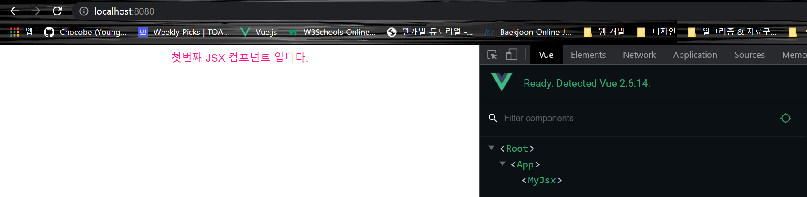
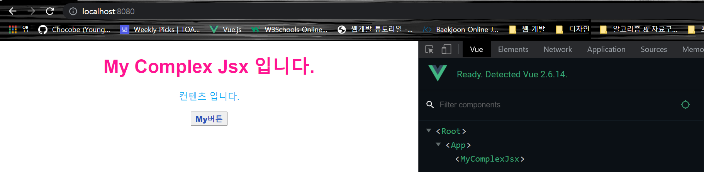

##### top
# Vue JSX 스터디

* [01. 개요](#01)

* [02. JSX 환경설정 - babel](#02)

* [03. 첫번째 JSX 컴포넌트](#03)


<br/><hr/><br/>


##### 01
## 01. 개요

Vue 컴포넌트를 작성할 때 일반적인 방법은 다음과 같습니다.

```html
<!-- 경로: "@/components/MyComponent.vue"> -->

<template>
  <div>
    <h1 class="my-title">{{ msg }}</h1>
  </div>  
</template>

<script>
export default {
  data: () => ({
    msg: "My Component 입니다.",
  }),
};
</script>

<style scoped>
.my-component {
  color: #ff1493;
}
</style>
```

<br/>

<br/>

<br/>

위의 코드에서 ``<template>``을 생략하고, render(h) 메서드로 구현하면 다음과 같습니다.

```html
<!-- 경로: "@/components/MyRender.vue" -->

<script>
export default {
  data: () => ({
    msg: "My Render 입니다.",
  }),

  render(h) {
    return h("h1", {
      class: ["my-render-title"],
      
      domProps: {
        innerHTML: this.msg,
      },
    });
  },
};
</script>

<style scoped>
.my-render-title {
  color: #03a9f4;
}  
</style>
```

<br/>

<br/>

<br/>

render(h) 를 사용해도 동일한 결과가 나옵니다.

만약, MyRender.vue 의 하위 요소가 3개 라면 다음과 같이 작성하게 됩니다.

```html
<!-- 경로: "@/components/MyComplexJsx.vue" -->

<script>
export default {
  data: () => ({
    title: "My Complex Render 입니다.",
    contents: "컨텐츠 입니다.",
    buttonName: "버튼명",
  }),

  render(h) {
    return h("div", [
      h("h1", {
        class: ["my-complex-title"],
        domProps: {
          innerHTML: this.title,
        },
      }),

      h("p", {
        class: ["my-complex-contents"],
        domProps: {
          innerHTML: this.contents,
        },
      }),

      h("button", {
        class: ["my-complex-button"],
        domProps: {
          innerHTML: this.buttonName,
        },
      }),
    ]);
  },
};
</script>

<style scoped>
.my-complex-title {
  color: #ff1493;
}

.my-complex-contents {
  color: #34eb7a;
}

.my-complex-button {
  color: #2b51b9;
  font-weight: 900;
}
</style>
```

<br/>

<br/>

위의 MyComplexRender 컴포넌트에서 하위 요소를 출력하기 위해 작성한 render(h) 메서드를 보면, 상당히 복잡해 보입니다.

```javascript
render(h) {
  return h("div", [
    h("h1", {
      class: ["my-complex-title"],
      domProps: {
        innerHTML: this.title,
      },
    }),

    h("p", {
      class: ["my-complex-contents"],
      domProps: {
        innerHTML: this.contents,
      },
    }),

    h("button", {
      class: ["my-complex-button"],
      domProps: {
        innerHTML: this.buttonName,
      },
    }),
  ]);
};
```

<br/>

여기서 사용한 ``h()`` callback 함수는 ``createElement()`` 함수로, DOM 요소를 VNode 로 만들어주는 callback 함수 입니다.

Javascript 함수 문법에 맞는 입력을 하다보니, 위와같이 복잡한 코드를 작성하게 되는데, 이 문제를 해결할 수 있는 방법이 ``JSX`` 입니다.


<br/>

[🔺 Top](#top)

<hr/><br/>


##### 02
## 02. JSX 환경설정 - babel

JSX를 사용하기 위해서는 Babel 설정이 필요 합니다. (Vue CLI 프로젝트 한정 정리)

<br/>

필요한 페키지는 다음과 같습니다.

| 참조문서: https://github.com/yamoo9/Vue-CAMP/blob/master/Document/vue-jsx.md

* babel-plugin-syntax-jsx
* babel-plugin-transform-vue-jsx
* babel-helper-vue-jsx-merge-props
* babel-preset-env

<br/>

```bash
npm i -D babel-plugin-syntax-jsx babel-plugin-transform-vue-jsx babel-helper-vue-jsx-merge-props babel-preset-env
```

<br/>

설치가 완료되면 ``babel.config.js`` 에 다음과 같이 설정합니다.

```javascript
// 경로: <rootDir>/babel.config.js

module.exports = {
  presets: ["@babel/preset-env"],
  plugins: ["transform-vue-jsx"],
}
```

<br/>

설정을 한 후, ``npm run serve`` 로 실행하였을 때, 정상적으로 실행 된다면, 설정이 완료 된 상태 입니다.


<br/>

[🔺 Top](#top)

<hr/><br/>


##### 03
## 03. 첫번째 JSX 컴포넌트

JSX 를 사용하면, render(h) 메서드의 ``h`` 또는 ``createElement()`` 를 사용하지 않고, ``<template>`` 과 유사한 형식으로 코드를 작성할 수 있습니다.

아래 코드는 JSX 를 사용한 render() 메서드 구현 입니다.

```html
<!-- 경로: "@/components/MyJSX.vue" -->

<script>
export default {
  data: () => ({
    msg: "첫번째 JSX 컴포넌트 입니다.",
  }),

  render() {
    return <div class="my-jsx">{this.msg}</div>;
  },
};
</script>

<style scoped>
.my-jsx {
  color: #ff1493;
}
</style>
```

<br/>

<br/>

<br/>

위 코드의 render() 메서드가 마치 ``<template>`` 코드처럼 작성한 것을 알 수 있습니다.

이처럼 JSX 를 사용하면, 기존의 render(h) 메서드의 callback 함수인 h 또는 createElement 를 사용하지 않고, ``<template>`` 처럼 작성할 수 있는 장점이 있습니다.

<br/>

이번에는 좀 더 복잡한 ``<template>`` 을 가진 컴포넌트를 작성해 보겠습니다.

```html
<!-- 경로: "@/components/MyComplexJsx.vue" -->

<script>
export default {
  data: () => ({
    title: "My Complex Jsx 입니다.",
    contents: "컨텐츠 입니다.",
    buttonName: "My버튼",
  }),

  render() {
    return (
      <div>
        <h1 class="my-complex-title">{this.title}</h1>
        <p class="my-complex-contents">{this.contents}</p>
        <button class="my-complex-button">{this.buttonName}</button>
      </div>
    );
  },
};
</script>

<style scoped>
.my-complex-title {
  color: #ff1493;
}

.my-complex-contents {
  color: #03a9f4;
}

.my-complex-button {
  color: #2b51b9;
  font-weight: 900;
}
</style>
```

<br/>

<br/>

이상 JSX 정리를 마무리 하겠습니다.


<br/>

[🔺 Top](#top)

<hr/><br/>